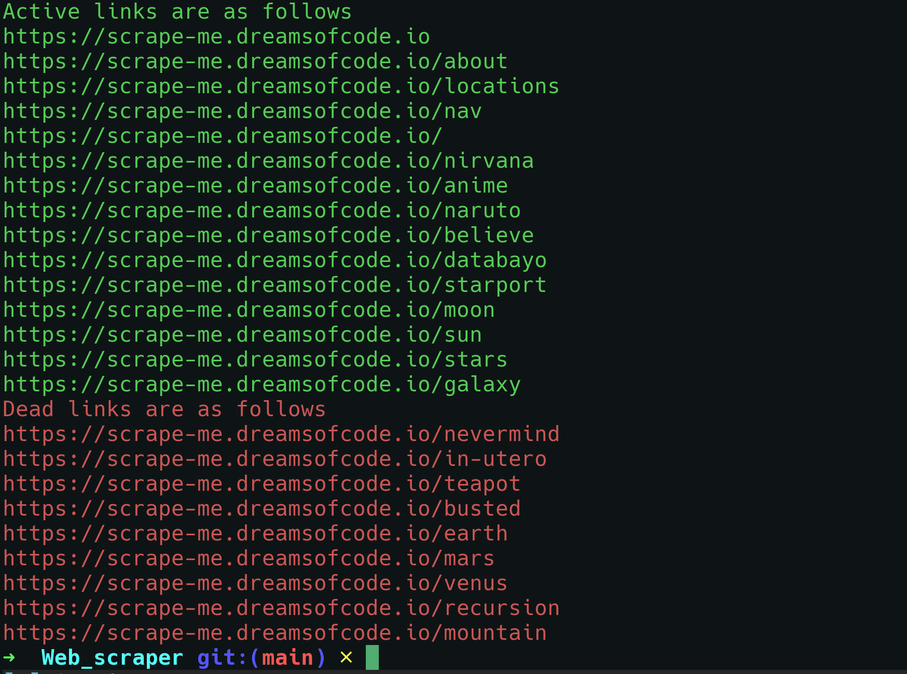

# Web Scraper

A Simple Web Scraper which will scrap the web pages with no html and segregate the active and deadlinks.

## Installation

Clone the repository

```bash
  git clone https://github.com/Pratham16112002/Web-Scraper.git
```

Install required modules

```bash
    go mod tidy
```

Run

```bash
    go run . -url <url>
```

## Screenshots


